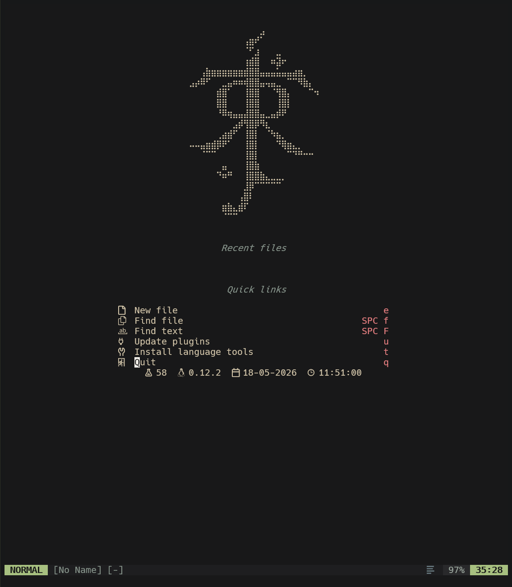
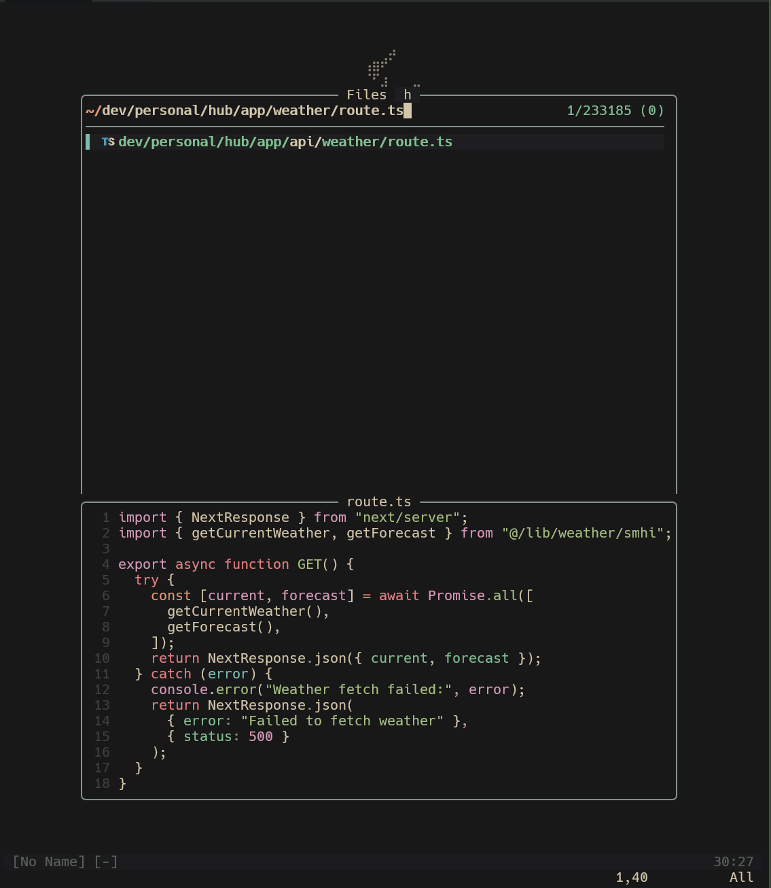
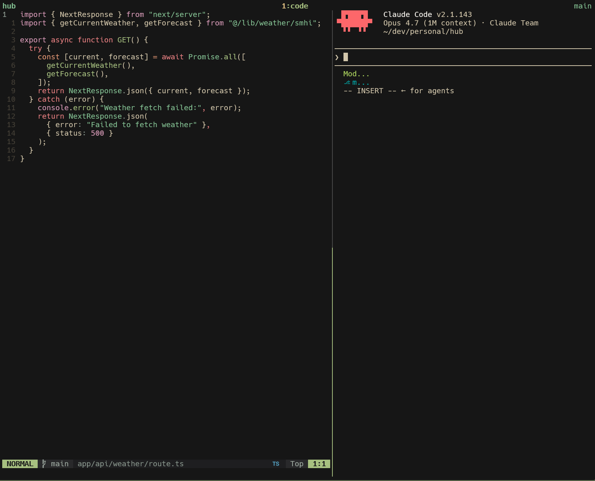

# nvim

Fredrik's personal Neovim configuration. Built for daily driving on WSL2, with a strong focus on C# (.NET Framework 4.8 over `/mnt/c`), TypeScript, Lua, Go, and Python.



## Philosophy

- **Mine, not yours.** This is a working setup, not a starter kit. It assumes WSL2 + Windows Terminal + a Nerd Font and won't apologise for the assumptions it makes.
- **Boring tech, sharp edges.** Standard plugins where they work; specialised ones where they don't. No churn for churn's sake.
- **Format-on-save by default** — opt out per-buffer with `<leader>ts`, not opt-in per-language.

## Stack

| Area | Plugin |
|---|---|
| Plugin manager | [lazy.nvim](https://github.com/folke/lazy.nvim) |
| Colourscheme | [everforest](https://github.com/sainnhe/everforest) with custom darken palette |
| Fuzzy finder | [fzf-lua](https://github.com/ibhagwan/fzf-lua) (no telescope) |
| File explorer | [oil.nvim](https://github.com/stevearc/oil.nvim) |
| LSP | [nvim-lspconfig](https://github.com/neovim/nvim-lspconfig) + [mason](https://github.com/williamboman/mason.nvim) |
| C# LSP | [roslyn.nvim](https://github.com/seblyng/roslyn.nvim) (Microsoft.CodeAnalysis.LanguageServer) |
| Completion | [nvim-cmp](https://github.com/hrsh7th/nvim-cmp) + [luasnip](https://github.com/L3MON4D3/LuaSnip) |
| AI chat / refactor | [CodeCompanion](https://github.com/olimorris/codecompanion.nvim) (Claude) |
| AI inline | [Codeium](https://github.com/Exafunction/codeium.vim) |
| Formatting | [conform.nvim](https://github.com/stevearc/conform.nvim) |
| Syntax | [nvim-treesitter](https://github.com/nvim-treesitter/nvim-treesitter) |
| Git | [gitsigns](https://github.com/lewis6991/gitsigns.nvim) + lazygit |
| Zen | [zen-mode](https://github.com/folke/zen-mode.nvim) |



## Prerequisites

| | Version | Notes |
|---|---|---|
| Neovim | 0.12.2+ | apt usually ships an older version; install latest binary into `/opt` |
| .NET SDK | 10.0+ | Required by current Roslyn LS, even if your code targets older frameworks |
| Nerd Font | any | Configured in your terminal, not nvim |
| ripgrep, fd | latest | For fzf-lua's grep and file pickers |
| Node.js, Go, Python | runtime versions | For their respective LSPs and formatters |

WSL2 specific:
- Clipboard shims (`wl-copy`/`wl-paste`/`pbcopy`/etc.) in `~/.local/bin` that route to `clip.exe` / PowerShell. Without them, system clipboard integration is dead.
- `git.exe` on PATH returns Windows-style paths (`C:/...`) — the fzf-lua keymap for `<leader>ff` normalises these to `/mnt/c/...` automatically.
- Roslyn LS on solutions hosted under `/mnt/c/...` works but first load is slow. `filewatching = 'off'` is mandatory.

## Install

```bash
# Back up anything existing
mv ~/.config/nvim ~/.config/nvim.bak 2>/dev/null

# Clone
git clone https://github.com/fredriksvahn/kickstart.nvim.git ~/.config/nvim

# Launch — lazy.nvim will install plugins on first run
nvim
```

After first launch:

```vim
:Lazy sync
:MasonToolsInstall
```

For C# you also need:

```bash
sudo apt install dotnet-sdk-10.0
```

…then in nvim, open a `.cs` file inside a solution and the Roslyn LS will attach.

## Layout

```
~/.config/nvim
├── init.lua                       entry point — minimal, just kicks off lazy and the namespace
├── lua/
│   ├── fredriksvahn/              user config (not plugins)
│   │   ├── options.lua            vim options
│   │   ├── keymaps.lua            keymaps
│   │   ├── autocmds.lua           auto-loads everything under utils/
│   │   ├── theme.lua              everforest darken overrides
│   │   └── utils/                 auto-loaded setup files (diagnostics, …)
│   └── plugins/                   one file per plugin / domain — auto-imported by lazy
└── KEYMAP_README.md               generated keymap cheat sheet
```

## Keymaps

Leader is `<Space>`. See [KEYMAP_README.md](./KEYMAP_README.md) for the full table.

Highlights:

| | |
|---|---|
| `<leader>ff` | Find file in git repo root (auto-handles `/mnt/c` paths) |
| `<leader>fG` | Live grep across project |
| `<leader>fn` | Find file in nvim config |
| `<leader>fk` | Search all keymaps fuzzily |
| `-` | Open parent dir in oil |
| `<leader>cc` | CodeCompanion actions |
| `<leader>ct` | CodeCompanion chat toggle |
| `<leader>cl` | Claude Code in tmux pane (or vsplit if no tmux) |
| `<leader>rt` | Roslyn: pick target solution |
| `<leader>rR` | Roslyn: restart server |
| `<leader>ts` | Toggle format-on-save |
| `<leader>z` | Zen mode |
| `gd`, `gr` | LSP definitions / references (via fzf-lua) |
| `<Space>` (wait) | which-key: browse every leader binding by category |



## Maintenance

```vim
:Lazy update                       update plugins
:MasonToolsInstall                 install / update LSPs and formatters
:checkhealth                       diagnose anything broken after major version bumps
```

When Neovim ships a new minor (0.12 → 0.13 etc.), expect a round of `vim.deprecated` warnings to clean up.

---

Originally based on [kickstart.nvim](https://github.com/nvim-lua/kickstart.nvim) — diverged enough by 2026 to stand alone.
